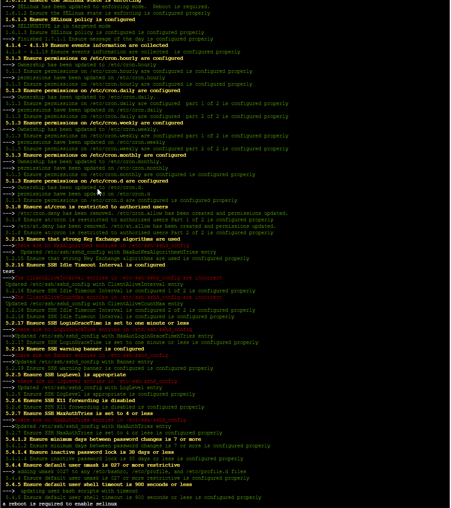

# linux Hardening Security Scripts

The linux-hardening directory is used as a repo to as source for security.  The found here were created with  intended purpose to address some benchmarks found in AWS Inspector.  They were designed to only be run against the jump boxes.

### Directory Lay out

The template directory will contain files that will replace existing system files.  These are config files or rules files.  Currently only the audit-rules is being used in the scripts.

### Scripts

Each scripted is named linux-<benchmark>.sh.  The benchmark matches with a certain CIS or AWS inspector benchmark we were looking to address.

### SeLinux

SeLinux can be a sensitive subject.  Turning it on is done though linux-1.6.1.2.sh and linux-1.6.1.3.sh.  commenting out are deleting those files will prevent them from being run.

#### Exception

linux-4.1.1-audit.sh addresses benchmark 4.1.4 - 4.1.19 which is solved by replacing the audit rules files.

### Execution

The script, all-hardening.sh, will run all the other scripts.  Commenting out or deleting a script will prevent it from executing.  The scripts are designed to provide some output.  First its echo's the benchmark that is being addressed and output if it was successful or not.  Some scripts will also output if there was a problem in red.  Keep in mind this is a work in progress.

### Script Output

